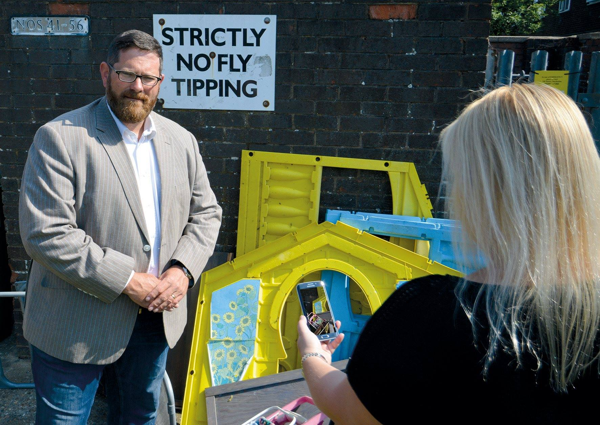

Working with contractors Serco, the council is setting up a brand new scheme for up to 20 residents who are keen to make a real difference to their community. Five of those selected will join a pilot scheme in the early part of the summer with the remainder joining later in the year.
 
The community champions will work voluntarily as an extra pair of eyes and ears on the ground to report environmental problems such as littering, graffiti, fly tipping, abandoned vehicles and dog fouling. The scheme will run throughout the summer and each volunteer will be given a smart phone with the Love Rushmoor mobile app loaded to report any issues they spot. It is free for community champions to take part and all costs of the scheme will be borne by Serco.
 
Champions can commit as much or as little time as they are able to give, on the way to or from work and home, or they could be part of a community neighbourhood group – there is no typical community champion. Full training will be given.
 
The champions would be totally independent of the council and their voluntary efforts would run alongside work already being carried out by officers and contractors across the borough. 

Anyone interested in finding out more about the scheme or applying to join can do so on the council’s website, [www.rushmoor.gov.uk/communitychampions](http://www.rushmoor.gov.uk/communitychampions).
 
The closing date for applications is **Sunday 10 June**,
 
Councillor Martin Tennant, Rushmoor Borough Council’s Cabinet member for Environment and Service Delivery, said: “We know there are residents who are passionate about their neighbourhood and want to play a part in helping us to keep it a clean and a green place for their families and friends to live in.
 
> “We would love to have them on board as community champions because residents are the ones that know their neighbourhoods best and the ‘hot spots’ that need tackling.”
 
Rob Noble, Contract Manger, Serco, said: 

> “The community champions scheme will provide volunteers across Rushmoor the tools, training and support to report issues that matter most to them, keeping the borough clean and reducing enviro crime, such as fly-tipping. Serco are proud to be delivering this exciting community initiative and are really looking forward to working with our local champions soon.” 

_Councillor Martin Tennant, Rushmoor Borough Council’s Cabinet member for Environment and Service Delivery, watches as a fly-tip is reported._

